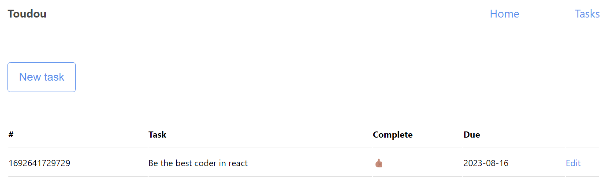

# Todo List Flask app



## Introduction
Welcome to **Toudou**, a simple yet powerful **todo list web application**! Toudou is a personal project (taken from a version made in python), that respect the creation of a **CRUD** (Create, Read, Update, Delete) application for managing todos. This project is built using React.js.
With Toudou, you can **easily** manage your daily tasks and keep track of your progress towards achieving your goals. The intuitive user interface allows you to create, update, and delete todos, as well as view your todos by priority or due date. Additionally, the application provides user authentication and authorization to ensure that your todos remain secure.

## Features
Toudou provides a range of features to help you manage your todos:

**Create**: You can easily create new todos by entering a task, due date, and state (task complete or not).

**Read**: You can view all of your todos on the home page, and filter them by priority or due date. Additionally, you can view individual todos on their own page to see more details about the task.

**Update**: You can update existing todos by editing their task, due date, state, or priority level.

**Delete**: You can delete todos that are no longer needed.

Toudou's user interface is designed to be intuitive and easy to use, allowing you to quickly manage your todos and stay organized. Whether you're working on a school project, planning your daily tasks, or managing a team, Toudou has the features you need to get things done.

## Installation

**You only need to install the dependencies** :
```bash
$ npm install
```

## Usage


**Web Interface**

To use the application:
When you are inside the folder "Todo-List-React-App", use **this command :**
```bash
$ npm start 
```


**Notes**

- \<#> is the unique identifier of the task.
- \<task> is the description of the task.
- \<complete> is a boolean value indicating whether the task is complete or not.
- \<due> is the due date of the task in the format DD/MM/YY.

## Project status

I will probably add more options, like import/export csv and others. However, i think that it's a pretty good project to start learning React.js.